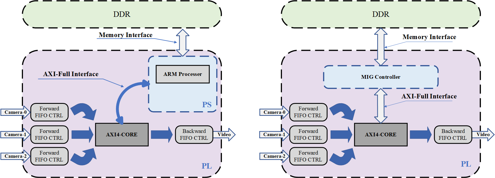

### Functional Description

This project is designed to stitching three videos into one video and display through HDMI.  The following are the block design of the this project and the result are displayed below.

Considering the universality of the AXI interface, this project is conveniently to transplant  into any kind of ZYNQ or FPGA platform. The following are the corresponding application framework on ZYNQ or FPGA. 

### Project Structure

The tree map of this project is shown as below:

> - vivado #vivado project folder
> - pic #picture
> - modelsim #
>   - wave.do #the modelsim wave file
> - RTL #all necessary code
>   - constrs_1 #fpga constrain files
>   - sim_1 #simulation files
>   - source_1 #source code

After cloning the code using git, you just need to open the Vivado project (version: 2023.1) and run the simulation.