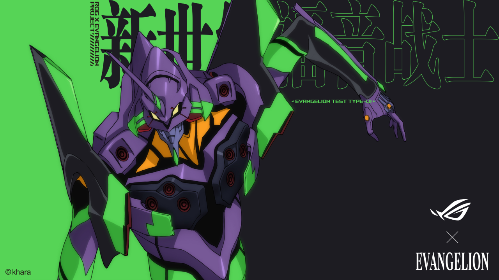

### Video Stitching

This repository consists of four branches, each of which is simulated with Questa sim and verified by the Xilinx FPGA board.

> | Branch                    | Functional Description                                       |
> | ------------------------- | ------------------------------------------------------------ |
> | Three_Frames              | Stitching three separate videos into one video.              |
> | Five_Frames               | Stitching five separate videos into one video.               |
> | VMDA                      | Ping-pong read-write single video into DDR using AXI-4 interface. |
> | DDR_Interface_Translation | Ping-pong read-write single video into DDR using APP interface. (Through AXI-4 to APP interface translation) |

### Demonstration

### Project Structure

The tree map of this project is shown as below:

> - vivado #vivado project folder
> - pic #picture
> - modelsim #
>   - wave.do #the modelsim wave file
> - RTL #all necessary code
>   - constrs_1 #fpga constrain files
>   - sim_1 #simulation files
>   - source_1 #source code

### Tips

For convenience, the Async FIFO used in this repository utilizes the Xilinx FIFO IP to enhance timing performance. The HDL Async FIFO is provided in the **RTL** folder for replacement.

Considering the universality of the AXI interface, this project can be conveniently transplanted into any kind of ZYNQ or FPGA platform. The following are the corresponding application frameworks on ZYNQ or FPGA.

